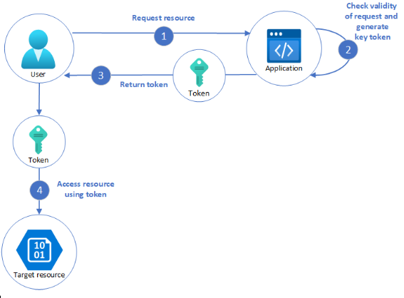

# Valet key pattern demo
Demo cách triển khai của valet key pattern.

https://learn.microsoft.com/en-us/azure/architecture/patterns/valet-key

## Giới thiệu mẫu thiết kế 
Valet Key design pattern là một phương pháp mà bạn tạo ra một "chìa khóa" đặc biệt (thường là một token, pre-signed URL, hoặc mã thông báo) để cấp quyền truy cập giới hạn vào một tài nguyên hay chức năng cụ thể. Điều này giúp bạn kiểm soát quyền truy cập của người dùng hoặc dịch vụ bên ngoài, tránh việc trao quyền truy cập toàn bộ vào tài nguyên.
- Mục đích:
   - Cung cấp quyền truy cập tạm thời: Cho phép người dùng hoặc dịch vụ bên ngoài truy cập vào một phần của hệ thống
   - Giới hạn quyền truy cập: Đảm bảo người dùng chỉ có thể truy cập vào tài nguyên hoặc thực hiện thao tác trong phạm vi bạn cho phép.
   - Bảo mật cao hơn: Giảm thiểu rủi ro bảo mật khi chia sẻ tài nguyên, vì các quyền truy cập này có thể được thu hồi hoặc tự động hết hạn sau một khoảng thời gian.


## Ngữ cảnh bài toán

- Ứng dụng thường xử lý dữ liệu từ kho lưu trữ để gửi đến hoặc nhận từ client, nhưng điều này tốn tài nguyên. Một giải pháp là cho phép client giao tiếp trực tiếp với kho dữ liệu, tuy nhiên cách này đòi hỏi chia sẻ thông tin bảo mật và làm giảm khả năng kiểm soát của ứng dụng. Trong các hệ thống phân tán với client không đáng tin cậy, ứng dụng cần kiểm soát truy cập một cách an toàn nhưng vẫn giảm tải bằng cách thiết lập kết nối và để client tự xử lý các thao tác dữ liệu.
- Để kiểm soát truy cập vào kho dữ liệu mà không cần ứng dụng quản lý trực tiếp xác thực và ủy quyền, giải pháp phổ biến là sử dụng valet key – một loại khóa hoặc token cấp quyền truy cập có thời hạn và quyền hạn cụ thể. Valet key cho phép client thực hiện các thao tác như tải lên, tải xuống hoặc ghi dữ liệu mà không cần ứng dụng xử lý trực tiếp việc truyền dữ liệu. Điều này giúp giảm tải cho máy chủ và ứng dụng, cải thiện hiệu suất và khả năng mở rộng. Sau thời gian hiệu lực, valet key tự động vô hiệu hóa hoặc có thể bị ứng dụng thu hồi sớm khi không còn cần thiết.

- Mẫu thiết kế này đơn giản hóa việc quản lý truy cập bằng cách loại bỏ quy trình tạo người dùng, cấp và thu hồi quyền, đồng thời hạn chế nguy cơ để lại các quyền truy cập lâu dài. Valet key có thể được thiết lập với phạm vi truy cập rất cụ thể, như một bảng, một hàng trong bảng, hoặc một tệp trong kho lưu trữ. Để bảo mật, cần giới hạn thời gian hiệu lực và phạm vi tài nguyên càng chặt chẽ càng tốt, đảm bảo khóa chỉ được sử dụng cho mục đích dự định.

## Cách hoạt động

<p>
   
</p>

## Ưu điểm

1. **Tăng cường bảo mật cho quyền truy cập**
* Quyền truy cập giới hạn: Valet Key cho phép chỉ định quyền truy cập cụ thể cho từng tài nguyên, giúp giảm thiểu rủi ro bị lạm dụng quyền.
* Thời gian hiệu lực ngắn hạn: Mỗi Valet Key có thời gian hiệu lực ngắn, giúp hạn chế quyền truy cập không mong muốn khi một Valet Key bị rò rỉ hoặc hết hạn.
2. **Quản lý truy cập linh hoạt**
* Dễ dàng cấp quyền tạm thời: Bạn có thể cấp quyền tạm thời cho một người dùng hoặc dịch vụ bên ngoài mà không cần thay đổi cài đặt bảo mật của toàn bộ hệ thống.
* Tích hợp tốt với các dịch vụ bên ngoài: Valet Key rất hữu ích khi bạn cần cấp quyền truy cập cho các ứng dụng bên thứ ba mà không muốn cho phép họ truy cập toàn bộ hệ thống.
3. **Giảm tải cho hệ thống quản lý truy cập**
* Đơn giản hóa quy trình xác thực: Thay vì cần phải xây dựng hệ thống xác thực phức tạp, bạn chỉ cần xác thực một token hoặc pre-signed URL.
* Tối ưu hóa tài nguyên: Khi Valet Key hết hạn, hệ thống không cần phải tiếp tục giám sát quyền truy cập của người dùng hoặc dịch vụ, giúp tiết kiệm tài nguyên.
4. **Thúc đẩy sự tự chủ của người dùng**
* Quyền kiểm soát dễ dàng hơn cho người dùng: Ví dụ như khi chia sẻ tài nguyên qua các pre-signed URLs, người dùng có thể tạo ra liên kết và quyết định thời gian hết hạn mà không cần quản trị viên can thiệp.


## Nhược điểm
1. **Khó khăn trong việc quản lý và theo dõi các token**
- <b>Rủi ro bảo mật khi token bị lộ</b>: Nếu một Valet Key hoặc pre-signed URL bị rò rỉ, nó có thể bị lạm dụng trong khoảng thời gian còn hiệu lực. Điều này đòi hỏi phải có cơ chế thu hồi hoặc theo dõi chặt chẽ.
- Khó kiểm soát số lượng lớn token: Trong các hệ thống lớn với hàng ngàn token được tạo ra, việc theo dõi và quản lý tất cả các token này có thể trở nên phức tạp.
2. **Phụ thuộc vào thời gian hiệu lực**
- Quá ngắn hoặc quá dài đều gây bất tiện: Nếu thời gian hiệu lực của Valet Key quá ngắn, người dùng có thể gặp khó khăn trong việc hoàn thành tác vụ của mình. Ngược lại, thời gian quá dài có thể làm tăng nguy cơ bị truy cập trái phép.
- Khó cân bằng giữa bảo mật và trải nghiệm người dùng: Việc xác định thời gian hiệu lực hợp lý cần dựa trên tình huống sử dụng cụ thể, đòi hỏi phải cân nhắc giữa mức độ bảo mật và trải nghiệm người dùng.
3. **Không phù hợp với các hệ thống quản lý quyền phức tạp**
- Không thể thay thế hoàn toàn các hệ thống quản lý quyền truyền thống: Valet Key không cung cấp khả năng quản lý quyền truy cập phức tạp như ACL, mà chỉ phù hợp cho các trường hợp truy cập tạm thời hoặc giới hạn.
- Không tối ưu trong các hệ thống với vai trò người dùng phức tạp: Trong các tổ chức lớn với nhiều vai trò và quyền truy cập khác nhau, cần kết hợp thêm các phương pháp khác để quản lý toàn bộ quyền truy cập.

## Điểm mạnh của Valet Key so với pattern khác
- Khả năng cấp quyền linh hoạt: So với ACL, Valet Key cho phép cấp quyền truy cập nhanh chóng và giới hạn thời gian, phù hợp cho các tình huống yêu cầu quyền truy cập ngắn hạn.
- Tính bảo mật cao hơn trong các dịch vụ bên ngoài: So với Proxy Pattern, Valet Key giúp giảm thiểu rủi ro bằng cách không cần phải duy trì kết nối trung gian lâu dài, chỉ cần sử dụng token hoặc URL có thời gian hết hạn.
- Đơn giản trong triển khai: Valet Key đơn giản hơn trong việc triển khai cho các ứng dụng nhỏ hoặc các dịch vụ lưu trữ đám mây.

## Các vấn đề và cân nhắc

1. **Quản lý thời gian hiệu lực của khóa**
Khóa nên có thời gian hiệu lực ngắn để giảm rủi ro truy cập trái phép, nhưng không quá ngắn để tránh làm gián đoạn thao tác của người dùng. Có thể cho phép gia hạn khóa khi cần.

2. **Kiểm soát quyền truy cập**
Chỉ cấp quyền cần thiết cho thao tác, ví dụ, quyền chỉ đọc cho tải xuống hoặc quyền chỉ ghi cho tải lên. Đảm bảo khóa áp dụng chính xác với tài nguyên được chỉ định.

3. **Kiểm soát hành vi người dùng**
Do mất một phần kiểm soát khi cấp khóa, cần hạn chế quyền tối đa dựa trên khả năng của dịch vụ, như giới hạn số lần sử dụng hoặc kích thước dữ liệu. Sử dụng cơ chế thông báo hoàn thành thao tác để thu hồi khóa nếu cần.

4. **Xác thực dữ liệu tải lên**
Dữ liệu tải lên phải được xác thực để tránh nội dung độc hại hoặc không hợp lệ, nhằm đảm bảo an toàn cho hệ thống.

5. **Kiểm tra hoạt động**
Nhật ký các hoạt động như tải lên/tải xuống giúp kiểm toán, phát hiện lỗi và tính phí người dùng dựa trên khối lượng dữ liệu.

6. **Cung cấp khóa an toàn**
Khóa có thể được nhúng trong URL hoặc qua chuyển hướng máy chủ, nhưng luôn cần dùng HTTPS để đảm bảo an toàn.

7. **Bảo vệ dữ liệu nhạy cảm khi truyền**
Dữ liệu nhạy cảm cần được mã hóa qua TLS khi truyền tải giữa ứng dụng và khách hàng..

## Khi nào nên và không nên sử dụng mẫu thiết kế này

* <b>Nên sử dụng khi</b>
   * Cần chia sẻ quyền truy cập tạm thời và giới hạn vào một tài nguyên cụ thể.  
   * Muốn giảm thiểu việc cấp quyền truy cập trực tiếp vào tài nguyên của hệ thống.
   * Muốn cung cấp cho người dùng khả năng tự tạo ra quyền truy cập với phạm vi và thời gian kiểm soát.
* <b>Không nên sử dụng khi</b>
   * Hệ thống cần quản lý quyền truy cập phức tạp và chi tiết cho nhiều nhóm người dùng.
   * Muốn cấp quyền truy cập dài hạn và liên tục, nơi mà việc sử dụng ACL sẽ hợp lý hơn.


### Ứng dụng
1. **Truy cập tạm thời vào lưu trữ đám mây (Cloud Storage)**
- Mô tả: Khi sử dụng các dịch vụ lưu trữ đám mây như Amazon S3, bạn có thể tạo pre-signed URLs để cho phép người dùng tải lên hoặc tải xuống tệp từ một bucket mà không cần chia sẻ quyền truy cập đầy đủ.
- Ví dụ: Một ứng dụng cần cho phép người dùng tải lên ảnh hồ sơ của họ trực tiếp vào tài nguyên. Thay vì cho họ quyền truy cập trực tiếp vào S3, bạn có thể tạo ra một pre-signed URL cho phép họ tải lên ảnh trong 10 phút. Sau đó, URL này hết hạn và không thể sử dụng được nữa.
- Lợi ích: Bảo mật cao hơn, tránh việc cấp quyền truy cập rộng rãi vào toàn bộ bucket.
2. **Giới hạn quyền truy cập vào API**
- Mô tả: Valet Key có thể được sử dụng để tạo các API tokens có thời gian hiệu lực giới hạn, cho phép một ứng dụng hoặc dịch vụ bên ngoài truy cập vào một endpoint cụ thể của API.
- Ví dụ: Một dịch vụ tài chính cung cấp API cho đối tác để truy cập vào dữ liệu người dùng. Để bảo mật, dịch vụ này tạo ra một token API chỉ có hiệu lực trong 30 phút, cho phép đối tác truy cập vào một endpoint nhất định để lấy thông tin cần thiết.
- Lợi ích: Kiểm soát tốt hơn việc ai có quyền truy cập vào API và giới hạn quyền đó trong thời gian ngắn.
3. **Ủy quyền truy cập cho ứng dụng bên thứ ba**
- Mô tả: Khi một người dùng muốn cấp quyền cho một ứng dụng bên thứ ba để truy cập vào dữ liệu của họ trên một nền tảng (như Google hoặc Facebook), Valet Key có thể được sử dụng để cấp quyền tạm thời cho ứng dụng đó.
- Ví dụ: Khi bạn đăng nhập vào một ứng dụng mới bằng tài khoản Google của mình, Google sẽ tạo một token cho phép ứng dụng này truy cập vào các thông tin như địa chỉ email hoặc danh bạ của bạn trong một khoảng thời gian nhất định. Token này có thể bị xóa nếu bạn muốn ngừng cấp quyền.
- Lợi ích: Người dùng có thể kiểm soát quyền truy cập của các ứng dụng và thu hồi khi cần.
4. **Giới hạn quyền truy cập vào tài nguyên**
- Mô tả: Khi một người dùng chỉ được cấp quyền truy cập vào một phần của tài nguyên.
- Ví dụ: Khi bạn muốn xem thử bài giảng trên Coursera, bạn sẽ được cấp một token để có thể xem đoạn đầu ngắn của một video bài giảng. Sau khi xem xong, phần còn lại của video sẽ bị khóa
- Lợi ích: Kiểm soát tốt hơn việc ai có quyền truy cập vào API và giới hạn quyền đó trong thời gian ngắn, mang lại lợi ích kinh tế
# Demo

Đây là sản phẩn demo về việc truy cập vào một kho ảnh trong một khoảng thời gian ngắn sử dụng Valet Key.

## Requirements
- Node.js

## Installation
```bash
cd valet_key_pattern_demo
npm install
Tạo file .env chứa key của IAM AWS
  AWS_ACCESS_KEY_ID=
  AWS_SECRET_ACCESS_KEY=
```

## How to run
```bash
npm start
```
